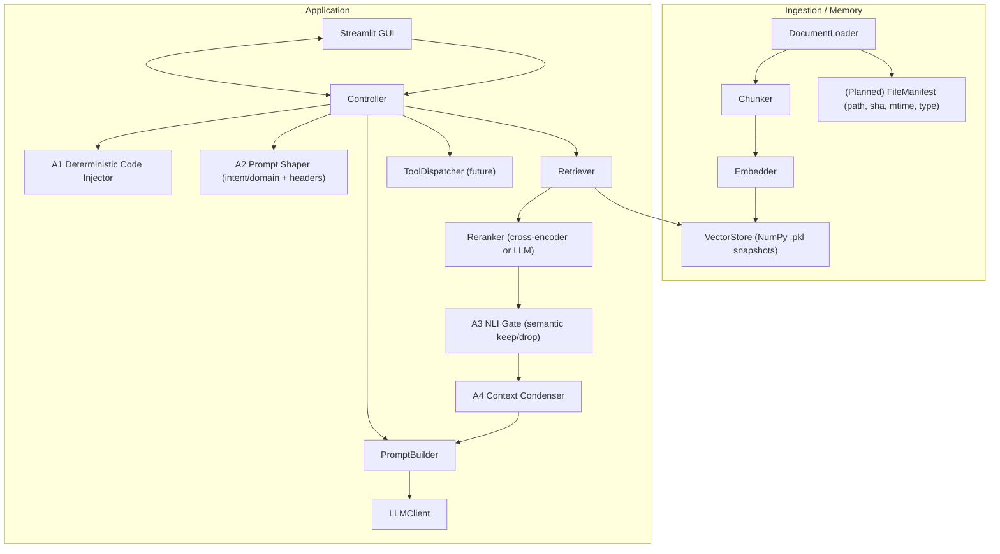

# RAGstream

RAGstream is a local-first RAG workbench created to pursue a long-standing goal: building my own retrieval system with explicit attention control and agentic orchestration. Long before recent changes to the ChatGPT UI, I wanted a GUI where I decide which documents are in or out for each prompt, plus a controller that inserts agents for deterministic file inclusion, prompt shaping, semantic gating, and context condensation. The UI changes only accelerated this plan. The immediate objective is to generate transparent Super-Prompts—inspectable, editable, and routable either back into ChatGPT UI or directly via API to models such as OpenAI GPT, Anthropic Claude, or Google Gemini. Where Aistratus emphasized disciplined AWS learning, RAGstream prioritizes practical control first and turns that journey into RAG education.

---

## Architecture

At a high level, RAGstream keeps ingestion and retrieval modular, adds four focused agents inside the Controller, and composes a transparent Super-Prompt before calling an LLM.



Design principles:

* Local-first: ingest, embed, store, and control context locally; call external LLMs only at the edge.
* Deterministic context: if you name a file, it appears verbatim in the prompt (or as a structured PACK for very large files).
* Agentic orchestration: small, purpose-built agents enhance correctness and control instead of a monolith.
* Transparency: editable Super-Prompt with citations and a record of what was kept/dropped.
* Model-agnostic: route to ChatGPT UI or call OpenAI/Claude/Gemini via API.

---

## Components

### Ingestion & Memory

* `DocumentLoader` discovers files under `data/doc_raw/`.

  * Current implementation: plain/unformatted text files (`.txt`, `.md`, `.json`, `.yml`).
  * Planned: rich/binary documents (`.pdf`, `.docx`).
* `Chunker` produces overlapping, token-aware windows.
* `Embedder` (BGE/E5 family) generates dense vectors.
* `VectorStore` persists vectors locally.

  * Current implementation: NumPy-backed `.pkl` snapshots (Chroma was disabled due to an environment bug).
  * Planned: on-disk Chroma once stable in this environment.
* `FileManifest` (planned): tracks `path`, `sha256`, `mtime`, `type` to support deterministic inclusion and change detection.

### Retrieval & Ranking

* Dense top-k search (cosine) over the local vector store.
* GUI inclusion/exclusion per file (ON/OFF) to steer eligibility.
* Cross-encoder rerank for precision (e.g., `mxbai-xsmall`) or an LLM-based reranker.
* Note: Reranker is a retrieval submodule (it scores order); it is **not** an agent.

### Four Agents (inside the Controller)

* **A1 Deterministic Code Injector (DCI)** — Deterministic.

  * Includes **full** content of explicitly named code/config files as a top-level `❖ FILES` block (or a structured PACK if the file is very large).
  * Supports “Exact File Lock” to skip retrieval entirely and use only named files.

* **A2 Prompt Shaper (intent/domain + meta-prompt headers)** — Model-driven (lightweight).

  * Predicts helpful **intent** (e.g., explain, design, implement, refactor, debug, test, review, plan, compare, decide, compute, translate, generate) and optional **domain** (software, AWS, research, writing, legal, music, etc.).
  * Proposes structured prompt headers: **SYSTEM, AUDIENCE, PURPOSE, TONE, CONFIDENCE, RESPONSE DEPTH, OUTPUT FORMAT** (and may suggest CHECKLIST/EXAMPLE if relevant).
  * Uses a small LLM (e.g., GPT-4o-mini) with deterministic templates as fallback; you always review/override in the GUI.
  * (Advisory) Can set sensible defaults for downstream strictness (e.g., higher NLI gate θ for CODE/TEST).

* **A3 NLI Gate (semantic gating)** — Model-driven (lightweight).

  * Given your prompt and candidate chunks, keeps only those that **entail/support** the need and drops irrelevant ones.
  * Typically runs on a lightweight LLM or a dedicated NLI/cross-encoder classifier.

* **A4 Context Condenser** — Model-driven (lightweight).

  * Compresses kept chunks into a cited `S_ctx` with three sections: **Facts** (minimal exacts like paths/lines), **Constraints** (decisions, limits), **Open Issues** (gaps/uncertainties).
  * A small model (e.g., GPT-4o-mini) is usually sufficient for high-quality condensation.

### Prompt Orchestration

Fixed authority order to prevent style from outranking facts:

```
[Hard Rules] → [Project Memory] → [❖ FILES] → [S_ctx] → [Your Task & Output Format] → [Optional Mode]
```

* **Hard Rules**: non-negotiable constraints (e.g., do not alter code blocks; follow exact spec boundaries).
* **Project Memory**: persistent project decisions and invariants (e.g., chosen stack, naming conventions).
* **S\_ctx**: structured, cited context produced by A4 (Facts / Constraints / Open Issues).
* **Optional Mode**: style/voice presets (e.g., INTP/ENTJ) applied only after facts.

### Local Tools (opt-in; future)

* Planned: `calc:` (SymPy subset), `py:` (restricted sandbox).
* First version uses **pure LLM** without local tool execution.

---

## Deterministic vs. Model-Driven

| Part                                       | Type          | Notes                                                                    |
| ------------------------------------------ | ------------- | ------------------------------------------------------------------------ |
| A1 Deterministic Code Injector             | Deterministic | Injects exact files; optional lock disables retrieval.                   |
| File ON/OFF eligibility (GUI)              | Deterministic | Manual inclusion/exclusion per prompt.                                   |
| PromptBuilder authority application        | Deterministic | Applies fixed ordering and token limits before the final call.           |
| Reranker                                   | Model-driven  | Cross-encoder or LLM scores order; does not make policy decisions.       |
| A2 Prompt Shaper (intent/domain + headers) | Model-driven  | Suggests headers + hints; deterministic templates as fallback; you edit. |
| A3 NLI Gate (semantic gating)              | Model-driven  | Keep/drop via NLI; lightweight classifier/LLM.                           |
| A4 Context Condenser (`S_ctx`)             | Model-driven  | Summarization with citations using a small LLM.                          |

---

## Current Status

Truth in delivery (Pre-MVP, Aug 2025):

* Implemented/available

  * Requirements and architecture documents.
  * Ingestion baseline for **plain/unformatted text** files (`.txt`, `.md`, `.json`, `.yml`).
  * Vector storage via **NumPy `.pkl` snapshots** (Chroma temporarily disabled due to an environment bug).
  * Repository scaffolding/dummy modules for retrieval, orchestration, UI, and agents (interfaces and stubs).

* Not implemented yet

  * Streamlit GUI, the four agents (A1–A4), PromptBuilder, LLMClient wiring.
  * Cross-encoder/LLM reranker integration.
  * FileManifest (sha/mtime/type), rich/binary ingestion (`.pdf`, `.docx`).

* Running status

  * No runnable UI or end-to-end pipeline at this stage; Quick Start is intentionally omitted.

---

## Roadmap (near term)

1. Implement A1 `❖ FILES` block (FULL vs PACK) and “Exact File Lock”.
2. Wire Retriever → Reranker → A3 NLI Gate → A4 Condenser to output a cited `S_ctx`.
3. Build Super-Prompt preview honoring the authority order; edit-in-place.
4. Add model picker (OpenAI / Anthropic / Google) with simple token/cost estimation.
5. Extend ingestion to `.pdf/.docx` and add `FileManifest` for change detection.
6. (Optional, later) Re-enable on-disk Chroma once environment issues are resolved.

---

## Repository Layout (planned)

```
ragstream/
  app/            # Controller + Streamlit UI (planned)
  config/         # Settings facade (planned)
  ingestion/      # Loader, Chunker, Embedder, VectorStore (plain text implemented; others planned)
  retrieval/      # Reranker, Retriever (stubs)
  orchestration/  # PromptBuilder, LLMClient (stubs)
  tooling/        # BaseTool, MathTool, PyTool, Registry, Dispatcher (future)
  utils/          # (optional) helpers (future)
data/
  doc_raw/        # source documents (plain text supported today)
  chroma_db/      # (planned) on-disk store once re-enabled
  vectors/        # NumPy .pkl snapshots (current)
```

---

## License & Author

Planned: Apache-2.0
Author: Rusbeh Abtahi · [roosbab@gmail.com](mailto:roosbab@gmail.com)
