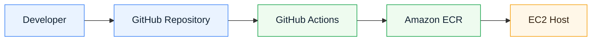
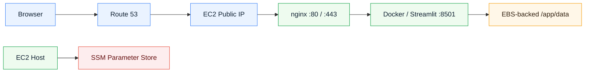
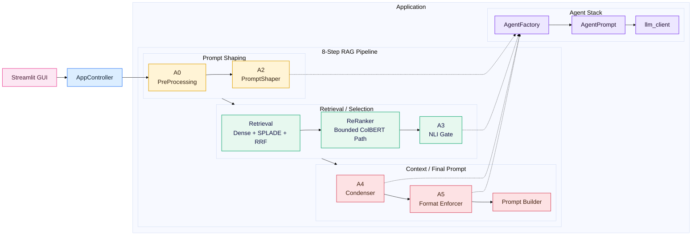
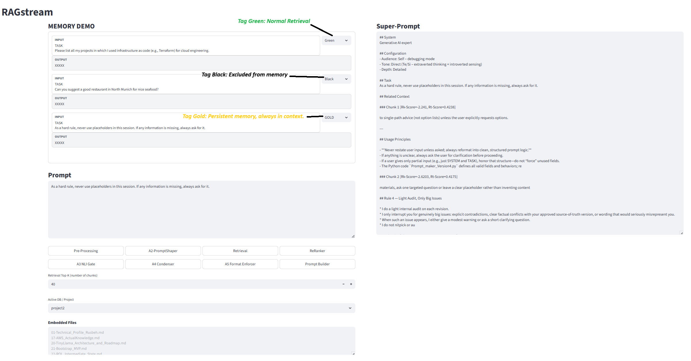
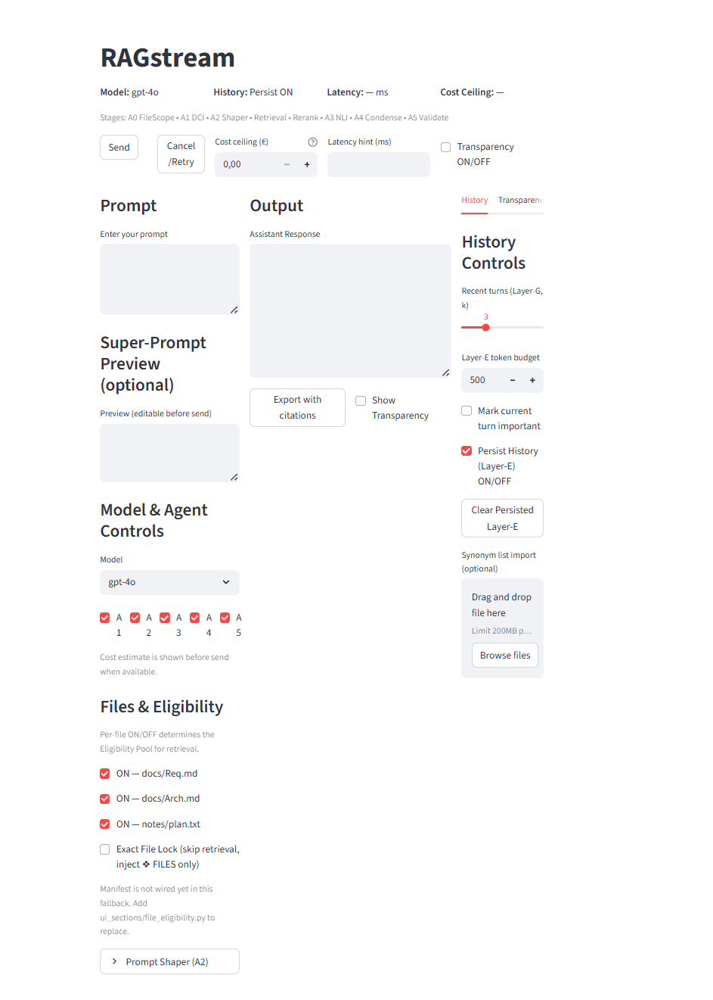

# RAGstream

RAGstream is an agentic software engineering system for building controllable multi-stage knowledge, retrieval, memory, and orchestration pipelines around large language models, with AWS deployment and DevOps delivery built into its architecture. It ingests project documents into persistent vector stores, combines deterministic preprocessing, retrieval, reranking, and prompt construction with JSON-defined LLM stages, and assembles an explicit SuperPrompt that can be sent either to external UIs or directly to APIs. Its LLM-facing stages run through a neutral Agent Stack (`AgentFactory`, `AgentPrompt`, `llm_client`), so agent behavior is versioned as configuration rather than scattered prompt logic.

A0_PreProcessing, A2_PromptShaper, project-scoped ingestion, and Retrieval are implemented and wired. ReRanker is implemented in code and is currently being redesigned after practical evaluation. Memory and tag-aware history management are under active development: the current GUI already exposes the intended direction of the memory layer, while durable history ingestion, semantic retrieval, and tag-governed memory workflows are being completed.

RAGstream is also deployed on AWS through a GitHub Actions → ECR → EC2/Docker → nginx → HTTPS delivery path and an active DevOps pipeline. The current deployment uses Route 53 for DNS, SSM Parameter Store for secrets, and EBS-backed runtime data outside the image, so project documents and vector stores persist independently of container replacement.

The system is designed to keep deterministic control logic, LLM-driven stages, memory, and deployment operations explicit at each layer, while remaining aligned with requirements, architecture, UML, code, and evaluation work as the project evolves.

---

## Deployment & DevOps

RAGstream already has a working Phase-1 deployment path. Public traffic goes through HTTPS to nginx on EC2, and the application runs inside Docker behind the reverse proxy. Runtime project data is stored outside the image so that ingested files and Chroma databases survive container replacement. Detailed operational steps live in `RAGstream_AWS_Deployment_Guide_v02.md` and `RAGstream_HTTP_Proxy_Arch.md`.


```mermaid
flowchart LR
  classDef dev fill:#EAF3FF,stroke:#3B82F6,color:#123;
  classDef build fill:#EEFBEF,stroke:#16A34A,color:#123;
  classDef run fill:#FFF7E8,stroke:#F59E0B,color:#321;

  DEV[Developer]:::dev --> GH[GitHub Repository]:::dev
  GH --> GA[GitHub Actions]:::build
  GA --> ECR[Amazon ECR]:::build
  ECR --> EC2[EC2 Host]:::run
```


```mermaid
flowchart LR
  classDef edge fill:#EAF3FF,stroke:#3B82F6,color:#123;
  classDef host fill:#EEFBEF,stroke:#16A34A,color:#123;
  classDef data fill:#FFF7E8,stroke:#F59E0B,color:#321;
  classDef sec fill:#FDEDEE,stroke:#E74C3C,color:#611;

  USER[Browser]:::edge --> R53[Route 53]:::edge
  R53 --> IP[EC2 Public IP]:::edge
  IP --> NGINX[nginx :80 / :443]:::host
  NGINX --> APP[Docker / Streamlit :8501]:::host
  APP --> DATA[EBS-backed /app/data]:::data
  EC2[EC2 Host]:::host --> SSM[SSM Parameter Store]:::sec
```

Near-term deployment direction remains incremental rather than architectural replacement. The current path stays GitHub Actions -> ECR -> EC2 -> Docker -> nginx, while later authentication and user-facing control can be extended further, for example with Cognito-based flows that are already documented as future work in the deployment and GUI requirements.

---

## Architecture

At a high level, RAGstream keeps ingestion and retrieval separated from generation, runs a linear 8-step RAG pipeline inside a Controller, and uses a neutral Agent Stack (`AgentFactory` + `AgentPrompt` + `llm_client`) for all LLM-based stages.


```mermaid
%%{init: {
  "theme": "base",
  "themeVariables": {
    "fontSize": "20px"
  },
  "flowchart": {
    "htmlLabels": true,
    "curve": "basis",
    "nodeSpacing": 30,
    "rankSpacing": 35
  }
}}%%
flowchart LR

  classDef gui fill:#FCE7F3,stroke:#EC4899,stroke-width:1.5px,color:#4A1D36;
  classDef ctrl fill:#DCEEFF,stroke:#3B82F6,stroke-width:1.5px,color:#123;
  classDef prep fill:#FFF4D6,stroke:#E0A100,stroke-width:1.5px,color:#321;
  classDef retr fill:#E7F8EF,stroke:#19A974,stroke-width:1.5px,color:#114;
  classDef gen fill:#FDE2E4,stroke:#D9485F,stroke-width:1.5px,color:#421;
  classDef agent fill:#EDE7FF,stroke:#7C3AED,stroke-width:1.5px,color:#213;

  UI[Streamlit GUI]:::gui --> CTRL[AppController]:::ctrl

  subgraph APP["Application"]
    direction LR

    subgraph PIPE["8-Step RAG Pipeline"]
      direction LR

      subgraph BOX1["Prompt Shaping"]
        direction TB
        A0[A0<br/>PreProcessing]:::prep --> A2[A2<br/>PromptShaper]:::prep
      end

      subgraph BOX2["Retrieval / Selection"]
        direction TB
        RET[Retrieval<br/>Dense + SPLADE + RRF]:::retr --> RRK[ReRanker<br/>Bounded ColBERT Path]:::retr
        RRK --> A3[A3<br/>NLI Gate]:::retr
      end

      subgraph BOX3["Context / Final Prompt"]
        direction TB
        A4[A4<br/>Condenser]:::gen --> A5[A5<br/>Format Enforcer]:::gen
        A5 --> PB[Prompt Builder]:::gen
      end

      BOX1 --> BOX2 --> BOX3
    end

    subgraph AG["Agent Stack"]
      direction TB
      AF[AgentFactory]:::agent --> AP[AgentPrompt]:::agent
      AP --> LLM[llm_client]:::agent
    end
  end

  CTRL --> A0

  A2 -.-> AF
  A3 -.-> AF
  A4 -.-> AF
  A5 -.-> AF
```
```mermaid
%%{init: {
  "theme": "base",
  "themeVariables": {
    "fontSize": "16px"
  },
  "flowchart": {
    "htmlLabels": true,
    "curve": "basis",
    "nodeSpacing": 30,
    "rankSpacing": 35
  }
}}%%
flowchart LR

  classDef core fill:#EAF7EA,stroke:#22A06B,stroke-width:1.5px,color:#123;
  classDef io fill:#EAF3FF,stroke:#3B82F6,stroke-width:1.5px,color:#123;
  classDef store fill:#FFE9E7,stroke:#E76F51,stroke-width:1.5px,color:#611;
  classDef mem fill:#FDE2E4,stroke:#D9485F,stroke-width:1.5px,color:#421;

  subgraph ING["Ingestion / Memory"]
    direction LR

    subgraph DOC["Document Ingestion"]
      direction LR
      IM[IngestionManager]:::core --> LDR[DocumentLoader]:::io
      LDR --> CHK[Chunker]:::io
      CHK --> EMB[Embedder]:::io
      EMB --> VS[Chroma Vector Store]:::store
      IM --> FM[FileManifest]:::store
    end

    subgraph MEM["History / Memory"]
      direction TB
      LOG[Conversation Log]:::mem
      TAG[Tags / Metadata]:::mem
      HIST[History Store<br/>under development]:::mem
      LOG --> HIST
      TAG --> HIST
    end
  end

  HIST --> VS
  ```
### Design principles

- **Local-first, inspectable**  
  Project data lives in a local directory tree (documents, Chroma DBs, logs, JSON configs). The same relative runtime structure is preserved on AWS through the EC2 bind mount.

- **Explicit file and context control**  
  Ingestion and retrieval keep track of which files, chunks, and later history items are eligible to influence a run.

- **Agent Stack as neutral infrastructure**  
  A2, A3, A4, A5, and future helper agents use a neutral, stateless Agent Stack. A0_PreProcessing remains primarily deterministic, with optional LLM help later.

- **Separation of concerns**  
  Ingestion, retrieval, agent logic, controller orchestration, and GUI remain separate packages. The Controller wires stages together without hiding them.

- **LLM-neutral**  
  `llm_client` talks to OpenAI models today and is designed so that future backends can be added without changing stage contracts.

- **Transparent evolution path**  
  The implementation is documented through requirements, UML, architecture, deployment notes, and implementation-status snapshots so that code and documentation can evolve in a controlled way.

---

## Components

### Ingestion & Memory

Static documents are ingested through a deterministic pipeline.

- **Loader (`ingestion/loader.py`)**  
  Walks a raw document directory (`data/doc_raw/<project>/`) and reads the supported source files.

- **Chunker (`ingestion/chunker.py`)**  
  Splits each document into chunks with configurable size and overlap. The current implementation is deterministic and character-based.

- **Embedder (`ingestion/embedder.py`)**  
  Uses OpenAI `text-embedding-3-large` (configurable) to embed chunks into vectors.

- **Vector stores**  
  - **Document store**: ChromaDB collections under `data/chroma_db/<project>/`.  
  - **History store**: a separate tagged history layer is planned and partially reflected in the architecture and GUI work, but is not yet complete as a durable production path.

- **File manifest (`ingestion/file_manifest.py`)**  
  A JSON manifest tracks each raw file (path, hash, mtime, size) so that ingestion can update only changed content and keep the persistent store traceable.

Memory management is under active development. The current GUI already contains a development-side memory panel and tag semantics, while the durable history log, history embeddings, and tag-aware retrieval rules are still being built from the requirements and backlog.

### Retrieval & Ranking

Retrieval and reranking are separate deterministic stages.

- **Retrieval (`retrieval/retriever.py`)**  
  - Current implementation: project-aware dense retrieval using OpenAI embeddings, query splitting, and p-norm aggregation over query pieces.  
  - Current agreed next direction: hybrid first-pass retrieval with dense retrieval + SPLADE + RRF.

- **ReRanker (`retrieval/reranker.py`)**  
  - Current implementation: CPU-based cross-encoder reranking with `cross-encoder/ms-marco-MiniLM-L-12-v2`, dynamic chunk cleaning, and direct reranked ordering.  
  - Current agreed next direction: bounded ColBERT reranking on the Retrieval candidate band, with query splitting and fused ranking instead of full ranking replacement.

The current practical conclusion is simple: Retrieval already works well enough to serve as the backbone; the current ReRanker exists in code but is being replaced as a long-term ranking strategy.

### Agents inside the Controller

LLM-based stages are orchestrated through the Agent Stack.

- `AgentFactory` loads the JSON config for a given agent name/version and builds a configured `AgentPrompt`.
- `AgentPrompt` holds the neutral prompt-composition and validation logic.
- `llm_client` executes the actual model call.

On top of this infrastructure, the pipeline uses concrete stages:

- **A0_PreProcessing**  
  Deterministic normalization and schema mapping from raw prompt text into the internal SuperPrompt structure.

- **A2 PromptShaper**  
  Chooser-style agent that classifies `system`, `audience`, `tone`, `depth`, and `confidence` from `task`, `purpose`, and `context`.

- **A3 NLI Gate**  
  Current agreed direction: Multi-Chooser-style chunk labeling and duplicate marking on the reranked candidate set.

- **A4 Context Condenser**  
  Writer-style agent that produces `S_CTX_MD` from the selected chunks.

- **A5 Format Enforcer**  
  Writer / Extractor-style agent that normalizes the final response contract.

- **PromptBuilder**  
  Deterministic assembly of the final prompt blocks from the SuperPrompt.

### Prompt orchestration

The final prompt is built from a small number of explicit regions.

```text
[RAG Context]

1. Hard Rules
   - Global system constraints
   - Non-negotiable principles

2. Project / Memory Context
   - Project-level assumptions
   - Later: tagged history according to explicit retrieval rules

3. Optional explicitly loaded material
   - Future deterministic fetcher-style loading of files, code blocks, or notes

4. S_CTX_MD (from A4)
   - Facts
   - Constraints
   - Open issues / questions

5. Attachments (optional)
   - Longer excerpts kept for traceability and citations
```

Below this context block, the prompt carries the `SYSTEM`, `AUDIENCE`, `TASK`, `PURPOSE`, `TONE`, and `CONFIDENCE` fields from the SuperPrompt.

### Deterministic vs model-driven

| Component          | Nature                               | Notes |
|--------------------|--------------------------------------|-------|
| A0_PreProcessing   | Deterministic → Hybrid (later)       | Normalisation + schema mapping; optional LLM help later. |
| A2 PromptShaper    | Model-driven (Chooser)               | Fine-tuned A2 model maps `task/purpose/context` to five labels. |
| Retrieval          | Deterministic function               | Current dense retrieval is implemented; hybrid Retrieval is the agreed next step. |
| ReRanker           | Deterministic ranking stage          | Current cross-encoder reranker is implemented; bounded ColBERT reranking is the agreed next step. |
| A3 NLI Gate        | Model-driven (Multi-Chooser direction) | Chunk labeling and duplicate marking are under construction. |
| A4 Condenser       | Model-driven (Writer)                | Generates `S_CTX_MD` from selected chunks. |
| A5 Format Enforcer | Model-driven (Writer/Extractor)      | Enforces response format / contracts. |
| PromptBuilder      | Deterministic function               | Concatenates everything into a final prompt string. |

---

## Current Status

Implemented / available:

- Core documentation set:
  - `Requirements_Main.md`
  - `Requirements_AgentStack.md`
  - `Requirements_RAG_Pipeline.md`
  - `Requirements_Ingestion_Memory.md`
  - `Requirements_GUI.md`
  - `Requirements_Orchestration_Controller.md`
  - `Requirements_Quality_Governance.md`
  - `Architecture.md`
  - UML files for the main subsystem views
- Working document ingestion pipeline with Chroma-backed persistence.
- Deterministic A0_PreProcessing.
- JSON-based Agent Stack in code.
- A2 PromptShaper wired and live.
- Retrieval wired and live.
- ReRanker wired and live in code.
- Streamlit development GUI with:
  - prompt input,
  - SuperPrompt inspection,
  - 8 pipeline buttons,
  - project creation,
  - file import,
  - active DB selection,
  - embedded-file display,
  - Retrieval Top-K,
  - Retrieval / ReRanker inspection.
- AWS Phase-1 deployment with:
  - GitHub Actions -> ECR,
  - EC2 + Docker runtime,
  - nginx reverse proxy,
  - HTTPS,
  - Route 53,
  - SSM-backed secrets,
  - persistent runtime data outside the image.

Implemented but under redesign or still under construction:

- ReRanker exists, but the current cross-encoder direction is not accepted as the long-term solution.
- A3, A4, A5, and final PromptBuilder stabilization are still under construction.
- Memory / history ingestion and tagged retrieval are under construction.
- Evaluation, benchmarking, and richer governance automation are still being built on top of the current foundation.

---

## Roadmap (near term)

Near-term priorities:

1. **Upgrade Retrieval from dense-only to hybrid Retrieval**  
   - Add SPLADE as the sparse branch.  
   - Fuse dense Retrieval and sparse Retrieval with RRF.

2. **Replace the current ReRanker direction**  
   - Keep ReRanker as a separate stage.  
   - Move from the current cross-encoder path toward bounded ColBERT reranking with query splitting and fused ranking.

3. **Implement A3 as a real chunk-selection stage**  
   - Label reranked chunks (`Must_Keep`, `Useful`, `BorderLine`, `Discarded`).  
   - Mark duplicates against higher-ranked chunks.

4. **Continue the memory layer**  
   - durable history logging,  
   - tag-aware retrieval rules,  
   - explicit include/exclude semantics,  
   - cross-session import of selected history later.

5. **Stabilize the late pipeline**  
   - A4 Condenser, A5 Format Enforcer, PromptBuilder.

6. **Extend development governance and synchronization**  
   - keep requirements, architecture, UML, and implementation aligned as the system evolves.

---

## Repository Layout

The repository already contains a real working tree. A trimmed high-level view looks like this:

```text
ragstream/
  agents/                  # A2, A3, A4 agent modules
  app/
    controller.py          # Orchestrates pipeline stages
    ui_streamlit.py        # Current Streamlit GUI
  config/
    prompt_schema.json
    settings.py
  ingestion/
    loader.py
    chunker.py
    embedder.py
    file_manifest.py
    chroma_vector_store_base.py
    vector_store_chroma.py
    ingestion_manager.py
  memory/
    conversation_memory.py
  orchestration/
    super_prompt.py
    prompt_builder.py
    llm_client.py
    agent_factory.py
    agent_prompt.py
  preprocessing/
    preprocessing.py
    prompt_schema.py
    name_matcher.py
  retrieval/
    chunk.py
    retriever.py
    reranker.py
    attention.py
  utils/
    logging.py
    paths.py

data/
  agents/
  doc_raw/
  chroma_db/
  A2_SLM_Training/
```

---

## GUI (Streamlit)

### Current development GUI
 
RAGstream includes a Streamlit-based development GUI for stepping through the pipeline manually and inspecting intermediate state.

Current development view includes:

- raw prompt input,
- SuperPrompt inspection,
- manual 8-stage pipeline control,
- Retrieval Top-K control,
- project creation and file import,
- active project / DB selection,
- embedded-file visibility,
- retrieval and reranking inspection,
- an evolving memory section.

The current GUI image below shows the active development view:

<p align="center">
  
  <br/><em>Figure 1 – Current development GUI</em>
</p>

The memory section reflects the current direction of the memory architecture. It combines two complementary ideas:

- a persistent always-fed layer for pinned rules and durable context,
- and a retrieval-based semantic layer for normal memory selection.

The tag semantics shown in the current development view already reflect that direction:

- **Gold**: pinned persistent memory, comparable to always-included Layer-G context,
- **Green**: normal semantic memory entry,
- **Silver**: semantic memory entry with baseline weighting,
- **Black**: excluded memory entry, used to remove irrelevant or unwanted prompt/history material from future context.

The full memory workflow is still under construction, and its intended operational shape is the one illustrated in the development GUI shown in `Dev1.png`.

### Planned GUI (next phases)

The next GUI phases extend the current development view rather than replacing its logic.

Planned directions already documented in the requirements and backlog include:

- history view and tag editing,
- manual answer capture from external UIs,
- model selection and cost awareness,
- richer per-stage inspection,
- multi-history and multi-project controls,
- dynamic attention controls,
- deterministic loading of explicit text/material into context,
- later V-model-oriented development tooling.

<p align="center">
  
  <br/><em>Figure 2 – Conceptual vision of the later GUI direction</em>
</p>

---

## License & Author

This is a personal research and engineering project by **Rusbeh Abtahi**.

The codebase is MIT-licensed. The project is being developed as a transparent, inspectable RAG system whose requirements, architecture, UML, deployment, and implementation can evolve in a controlled way.
  