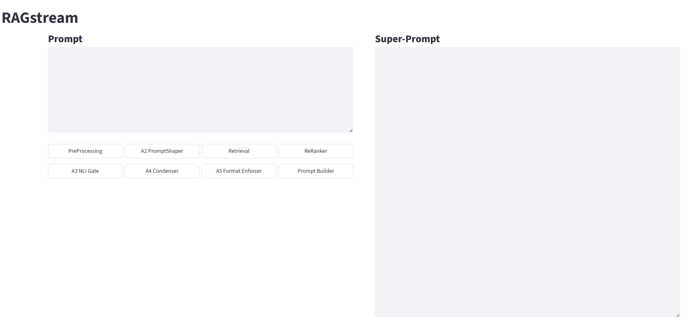
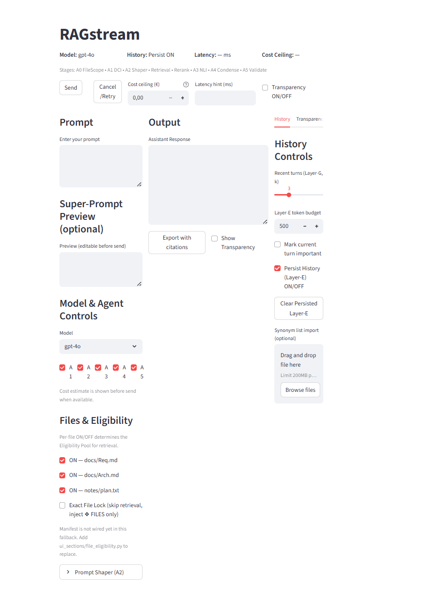

# RAGstream

RAGstream is a local-first RAG workbench for building transparent, controllable multi-agent pipelines around large language models. It ingests project documents into local vector stores (Chroma), runs a deterministic retrieval and reranking pipeline, and then assembles an explicit Super-Prompt that can be sent either to the ChatGPT UI or to APIs. Each intelligent step (prompt shaping, semantic gating, condensation, format enforcement) is implemented as a stateless agent whose behaviour is defined as data rather than hard-coded logic: JSON configurations are interpreted by an AgentFactory, so agents can be versioned and evolved like a small database. On top of this, the project is evolving toward a richer GUI where multi-project database selection, tagged conversation history (e.g. GOLD / SILVER / RED / BLUE), and V-model-inspired tooling for software-engineering tasks are orchestrated through the same agent stack.

The emphasis here is on *transparent RAG*: human-in-the-loop, deterministic where possible, and explicit about which parts are LLM-driven and which are pure retrieval / control logic.

---

## Architecture

At a high level, RAGstream keeps ingestion and retrieval strictly separated from generation, runs a linear 8-step RAG pipeline inside a Controller, and uses a neutral “Agent Stack” (AgentFactory + AgentPrompt + llm_client) to instantiate all LLM-based agents before composing the final Super-Prompt.


### Design principles

- **Local-first, inspectable**  
  All project data lives in a local directory tree (documents, Chroma DBs, logs, JSON configs). You can see and version everything in Git.

- **Explicit file and context control**  
  Ingestion and retrieval keep track of *what* is in memory. The long-term goal is that you can always answer: “Which files and chunks are influencing this answer, and why?”

- **Agents as orthogonal, data-defined modules**  
  A0/A2/A3/A4/A5 are stateless agents configured by JSON files (loaded via `AgentFactory`). Behaviour lives in data; Python classes just interpret that data. This makes agents easier to version, compare, and evolve.

- **Separation of concerns**  
  Ingestion, retrieval, agent logic, and GUI are separate packages. The Controller glues them together but does not hide the stages.

- **LLM-neutral**  
  The `llm_client` is designed to talk to OpenAI models first (both base and fine-tuned), but the interface is meant to be extendable to local SLMs/LLMs (TinyLlama, etc.) or other cloud backends later.

- **History and attention as first-class concepts (future)**  
  Conversation history will be ingested into the same memory system with tags (e.g. GOLD/SILVER/RED/BLUE), decay, and project labels, so that attention over time can be controlled explicitly rather than implicitly.

---

## Components

### Ingestion & Memory

Static documents and, later, conversation history are ingested through the same pipeline.

- **Loader (`ingestion/loader.py`)**  
  Walks a raw document directory (`data/doc_raw/<project>/`), reads supported files (`.txt`, `.md`, `.json`, `.yml` for now), and emits document objects.

- **Chunker (`ingestion/chunker.py`)**  
  Splits each document into semantic chunks (headings, paragraphs, code blocks) with size and overlap suitable for retrieval.

- **Embedder (`ingestion/embedder.py`)**  
  Uses OpenAI `text-embedding-3-large` (configurable) to embed chunks into vectors.

- **Vector stores**  
  - **Layer-E (embeddings)**: ChromaDB on-disk collections under `data/chroma_db/<project>/`. Used by N1_Retrieval and N2_Reranker.  
  - **History embeddings (future)**: conversation turns stored in a shared “history” Chroma collection, with tags (`project`, `session_id`, `tags[]`, etc.) and decay weights.

- **File manifest (`ingestion/file_manifest.py`) — Layer-G**  
  A manifest stored as JSON tracks each raw file (path, hash, mtime, size). It is used to:
  - Detect changes and re-embed only what changed.
  - Provide a “file-level” view of what the system knows, independent of chunk embeddings.

In later phases, the same abstractions will be reused for conversation history:

- All question/answer pairs will be written to a log file and ingested into a history Chroma collection.
- Each entry will carry tags (e.g. `["GOLD"]`, `["OFF_TOPIC"]`, `["PROJECT:RAGstream"]`) so that retrieval can filter by both semantic similarity and explicit user tags.
- Multiple histories can be combined by importing selected tagged turns from other sessions.

### Retrieval & Ranking

Retrieval is implemented as separate, stateless modules so that they can be reused and composed in the Controller.

- **N1_Retrieval (`retrieval/retriever.py`)**  
  - Given a query (from PreProcessing / A2) and a selected Chroma collection, returns the top-K candidate chunks.  
  - Supports multi-DB use: the Controller can call N1 on different `project` collections and then merge or keep them separate.  
  - Purely deterministic: no LLM involved.

- **N2_Reranker (`retrieval/reranker.py`)**  
  - Takes candidate chunks from N1 and re-scores them using a cross-encoder or LLM-based scoring (e.g. E-BERT or an OpenAI model).  
  - Returns a smaller, better-ordered list of chunks plus metadata (scores, file origins).  
  - Designed so that the same reranker can be reused for both documents and history.

The output of N2 feeds into A3 (NLI Gate) and then A4 (Context Condenser).

### Agents inside the Controller

Agents are stateless *runners* that orchestrate the LLM-based parts of the pipeline. All of them rely on the `AgentStack`:

- `AgentFactory.py` loads a JSON config for a given agent name/version and builds an `AgentPrompt` instance.
- `AgentPrompt.py` holds neutral fields like:
  - `system_text`, `purpose_text`
  - `input_payload` (e.g. `{task, purpose, context}` for A2)
  - `enums` (forced choices for labels)
  - `agent_type` (Chooser / Writer / Extractor)
- `llm_client.py` takes `AgentPrompt` plus a model ID (base or fine-tuned) and returns a parsed result.

On top of this neutral stack, we define concrete agents:

- **A0_PreProcessing**  
  - Nature: function today; can become Hybrid (function + agent) later.  
  - Responsibility:
    - Normalise raw user input: detect if it is free text, Markdown, JSON, TOON, YAML, etc.  
    - Map it into the internal SuperPrompt schema (`SYSTEM / AUDIENCE / TASK / PURPOSE / CONTEXT / TONE / CONFIDENCE`), using deterministic rules and, optionally, an LLM helper.  
  - Output: an initial `SuperPrompt` instance and a `prompt_ready` flag.

- **A2 PromptShaper**  
  - Type: *Chooser* agent (LLM-only).  
  - Input: `task`, `purpose`, `context` from the SuperPrompt (plus any pre-filled hints).  
  - Uses enums for:
    - `system` roles (e.g. Python programmer, AWS architect, friend, etc.; up to 1–3 roles)
    - `audience`, `tone`, `response_depth`, `confidence`  
  - Output: five labels (system, audience, tone, response_depth, confidence) that are written back into the SuperPrompt. The same fine-tuned model (A2) can be used in 2 passes:
    1. Infer the labels from `task/purpose/context`.
    2. Optionally re-check its own decision by seeing the full SuperPrompt.

- **N1_Retrieval**  
  - Not an agent; purely deterministic, described above.

- **N2_Reranker**  
  - Also deterministic (or numeric/model-driven without acting as an “agent”); described above.

- **A3 NLI Gate**  
  - Type: *Hybrid Chooser* agent.  
  - Input: ranked chunks from N2 and the SuperPrompt.  
  - Task: decide which chunks *really* belong to the current question, using NLI-style decisions (entails / contradicts / irrelevant).  
  - Output: `final_selection_ids` — a pruned list of chunks that will be condensed.

- **A4 Context Condenser**  
  - Type: *Writer* agent (LLM-only).  
  - Input: selected chunks + the SuperPrompt.  
  - Task: write `S_CTX_MD`, the condensed context block used in the final prompt, structured as:
    - Facts
    - Constraints
    - Open issues / questions  
  - Output: a compact markdown context that the LLM can “think from,” instead of raw chunk soup.

- **A5 Format Enforcer**  
  - Type: *Writer / Extractor* agent (LLM-only).  
  - Task: ensure that the final SuperPrompt and expected answer format follow a strict JSON / Markdown / code template (depending on the use case).  
  - This is where “contract style” prompts live.

- **PromptBuilder (deterministic)**  
  - Pure Python. Takes the SuperPrompt object (with fields filled by A0/A2/A4/A5 and retrieval output) and composes the final prompt string that will be sent to the LLM (or shown in the GUI for manual copy-paste).

### Prompt orchestration

The final prompt is built from a small number of explicit regions. A simplified mental model looks like this:

```text
[RAG Context]

1. Hard Rules
   - Global system constraints
   - Safety / guardrails
   - Non-negotiable principles

2. Project Memory
   - Persistent project-level notes (e.g. “this repo is RAGstream”, global assumptions)
   - Later: tagged GOLD history snippets

3. Optional FILES block (future Fetcher)
   - Explicitly fetched files or code blocks, if any
   - “If the user says PACK <file>, show it here verbatim.”

4. S_CTX_MD (from A4)
   - Facts
   - Constraints
   - Open issues / questions

5. Attachments (optional)
   - Longer excerpts or references that do not fit into S_CTX_MD
   - Kept mainly for traceability and citations
```

Below this “RAG Context” block, the prompt carries the `SYSTEM`, `AUDIENCE`, `TASK`, `PURPOSE`, `TONE`, and `CONFIDENCE` fields coming from the SuperPrompt, plus any additional instructions defined per use case.

### Deterministic vs model-driven

| Component          | Nature                         | Notes                                                                 |
|--------------------|--------------------------------|-----------------------------------------------------------------------|
| A0_PreProcessing   | Deterministic → Hybrid (later) | Normalisation + schema mapping; can optionally invoke an LLM helper. |
| A2 PromptShaper    | Model-driven (Chooser)         | Fine-tuned A2 model maps `task/purpose/context` to five labels.      |
| N1_Retrieval       | Deterministic function         | Pure vector search over Chroma collections.                           |
| N2_Reranker        | Deterministic / numeric        | Cross-encoder / LLM scoring, but no long-form generation.            |
| A3 NLI Gate        | Model-driven (Hybrid Chooser)  | Decides which chunks enter S_CTX_MD.                                 |
| A4 Condenser       | Model-driven (Writer)          | Generates S_CTX_MD from selected chunks.                             |
| A5 Format Enforcer | Model-driven (Writer/Extractor)| Enforces response format / contracts.                                |
| PromptBuilder      | Deterministic function         | Concatenates everything into a final prompt string.                  |

---

## Current Status

*Truth in delivery (pre-MVP, November 2025).*

Implemented / available:

- Modular requirements and architecture documents:
  - `Requirements_Main.md`
  - `Requirements_AgentStack.md`
  - `Requirements_RAG_Pipeline.md`
  - `Requirements_Ingestion_Memory.md`
  - `Requirements_GUI.md`
  - `Requirements_Orchestration_Controller.md`
  - `Backlog_Future_Features.md`
- Working **document ingestion pipeline** for `.txt`, `.md`, `.json`, `.yml`:
  - File manifest (Layer-G) with change detection.
  - Chunking and embedding via OpenAI.
  - Chroma-based vector store under `data/chroma_db/<project>/`.
- A first version of **PreProcessing**:
  - Schema (`prompt_schema.py`), name matching (`name_matcher.py`), and deterministic normalisation logic (`preprocessing.py`) that produces an initial SuperPrompt.
- **Streamlit GUI skeleton**:
  - Text areas for input prompt and SuperPrompt.
  - 8-button layout matching the pipeline (A0, A2, Retrieval, ReRanker, A3, A4, A5, PromptBuilder).
  - A0_PreProcessing is wired; the other buttons are placeholders awaiting pipeline wiring.
- Initial scaffolding for retrieval, reranker, orchestration, and SuperPrompt handling.

Not yet implemented (or only partially stubbed):

- Full end-to-end execution of all 8 pipeline stages via the Controller.
- JSON-defined AgentStack in code (`AgentFactory`, `AgentPrompt`, `llm_client`) driving A2/A3/A4/A5.
- Cross-encoder / LLM reranker integration with proper scoring, thresholds, and evaluation.
- Conversation history ingestion, tagging, and history-aware retrieval.
- Advanced GUI features (history panel, tag filters, model picker, cost estimation, multi-project attention control).

What this README intentionally does *not* provide (yet):

- A one-line “Quick Start” script. The project is used experimentally on a local dev machine and the setup is still evolving.
- Any guarantees of stability. Names and file structure may still change while the design converges.

---

## Roadmap (near term)

Near-term priorities (subject to change as experiments evolve):

1. **Wire the full 8-step pipeline in the Controller + GUI**  
   - Each button in the Streamlit GUI should call the corresponding function/agent.  
   - Make it possible to step through A0 → A2 → N1 → N2 → A3 → A4 → A5 → PromptBuilder for a single prompt.

2. **Implement the AgentStack in code (A2, A3, A4, A5)**  
   - JSON configs for each agent (enums, system text, purpose, model IDs, agent type).  
   - `AgentFactory` to build `AgentPrompt` instances from these configs.  
   - `llm_client` that can call OpenAI base models *and* the fine-tuned A2 model.

3. **Finish Retrieval + ReRanker integration**  
   - Solid API for N1_Retrieval and N2_Reranker.  
   - Support for multiple Chroma collections per project and combined retrieval strategies.

4. **First-class history and tagging**  
   - Log all question/answer pairs to a durable log.  
   - Ingest them into a history vector store with tags (GOLD / SILVER / OFF_TOPIC / PROJECT:XYZ).  
   - Add basic GUI controls to include/exclude tagged history from retrieval.

5. **Model selection and cost awareness**  
   - Simple dropdown in the GUI to choose the final answer model.  
   - Rough token and cost estimates for a given SuperPrompt (including agent pipeline usage).

6. **Ingestion extensions**  
   - Add support for PDFs / DOCX where feasible.  
   - Keep file manifest the single source of truth for what is in memory.

---

## Repository Layout (planned)

This is the intended structure; some parts are already present, others are still evolving.

```text
ragstream/
  app/
    controller.py          # Orchestrates pipeline stages
    ui_streamlit.py        # Streamlit GUI (intermediate manual-first UI)
    __init__.py

  config/
    settings.py            # Global config (paths, model names, etc.)
    # (future) agents/*.json  # Agent definitions (A2, A3, A4, A5)
    __init__.py

  data/
    doc_raw/               # Raw project documents (per-project directories)
    chroma_db/             # Chroma collections for each project
    history/               # (future) Conversation logs + embeddings

  ingestion/
    loader.py              # Load raw files
    chunker.py             # Chunk documents
    embedder.py            # Embed chunks
    file_manifest.py       # Track files in Layer-G
    chroma_vector_store_base.py
    vector_store_chroma.py
    ingestion_manager.py   # High-level ingestion orchestrator
    __init__.py

  retrieval/
    retriever.py           # N1_Retrieval
    reranker.py            # N2_Reranker (numeric/LLM scoring)
    attention.py           # (future) Eligibility / attention logic
    __init__.py

  orchestration/
    super_prompt.py        # SuperPrompt data model
    prompt_builder.py      # Deterministic PromptBuilder
    llm_client.py          # OpenAI and future backends
    agent_factory.py       # AgentFactory (planned)
    agent_prompt.py        # AgentPrompt (planned)
    __init__.py

  tooling/
    # (future) utilities, tools, etc.
    __init__.py

  utils/
    logging.py             # Logging helpers
    paths.py               # Centralised path handling
    __init__.py
```

---

## GUI (Streamlit)

### Intermediate GUI (Phase 1 – manual pipeline debugger)

RAGstream includes a custom-built GUI developed with Streamlit. The intermediate “lab” GUI is intentionally simple:

- A text area for the **raw user input** (what you would normally type into ChatGPT).
- A text area for the **SuperPrompt** (what RAGstream constructs as the final prompt).
- Eight buttons matching the pipeline:

  1. `A0_PreProcessing` – run deterministic normalisation and schema mapping.
  2. `A2_PromptShaper` – (future) call the A2 agent via AgentStack to infer system/audience/tone/depth/confidence.
  3. `N1_Retrieval` – (future) run vector search on the selected Chroma DB.
  4. `N2_Reranker` – (future) refine candidate chunks.
  5. `A3_NLI_Gate` – (future) keep/drop chunks with NLI reasoning.
  6. `A4_Condenser` – (future) generate S_CTX_MD.
  7. `A5_Format_Enforcer` – (future) enforce final format.
  8. `PromptBuilder` – (future) compose the final prompt string.

- Additional controls (planned / partially implemented):
  - A button to **ingest a document directory** into Chroma (`data/doc_raw/<project>` → `data/chroma_db/<project>`).  
  - A widget to **select the active project/DB** for retrieval.

The idea is to let the user run each stage manually, inspect the intermediate SuperPrompt in the right-hand box, and understand exactly what each component is doing before moving to a fully automated flow.

<p align="center">
  
  <br/><em>Figure 1 – Development view (manual 8-button mode)</em>
</p>


### Planned GUI (Phase 2 – history + tagging)

The next major GUI milestone is a more “product-like” interface:

- A main chat area where:
  - You can type prompts and choose the target model.
  - Either send the prompt directly to an API or just generate the SuperPrompt and paste it into the ChatGPT UI manually.
- A **history panel**:
  - Shows previous question/answer pairs.
  - Lets you apply tags (GOLD, SILVER, OFF_TOPIC, etc.) per turn.
  - Lets you filter which history segments participate in retrieval.
- A **context panel**:
  - Shows which project DBs are active.
  - Shows which chunks are in S_CTX_MD and which are in Attachments.
- Basic **cost estimation**:
  - Roughly estimate tokens and cost per call based on the SuperPrompt size and chosen model.

A much more advanced “Phase 3” GUI is sketched in the backlog:

- Multi-history management (import GOLD snippets from other sessions).
- Fine-grained attention controls (turn sources on/off, weight them, inspect eligibility).
- V-model-inspired tools for software development (link requirements, UML, code, and tests).
- Multi-agent views where different agents (PromptShaper, Judge, Planner, Coder) can be inspected separately.

<p align="center">
  
  <br/><em>Figure 2 – Conceptual vision of the complete RAGstream GUI</em>
</p>)

---

## License & Author

This is a personal research project by **Rusbeh Abtahi**.

The project is currently shared under an MIT-style license. The intention is not to build a polished library, but a clear, inspectable reference implementation of a modern, agentic RAG system that can evolve over time.

Feedback, issues, and thoughtful critique are very welcome.


