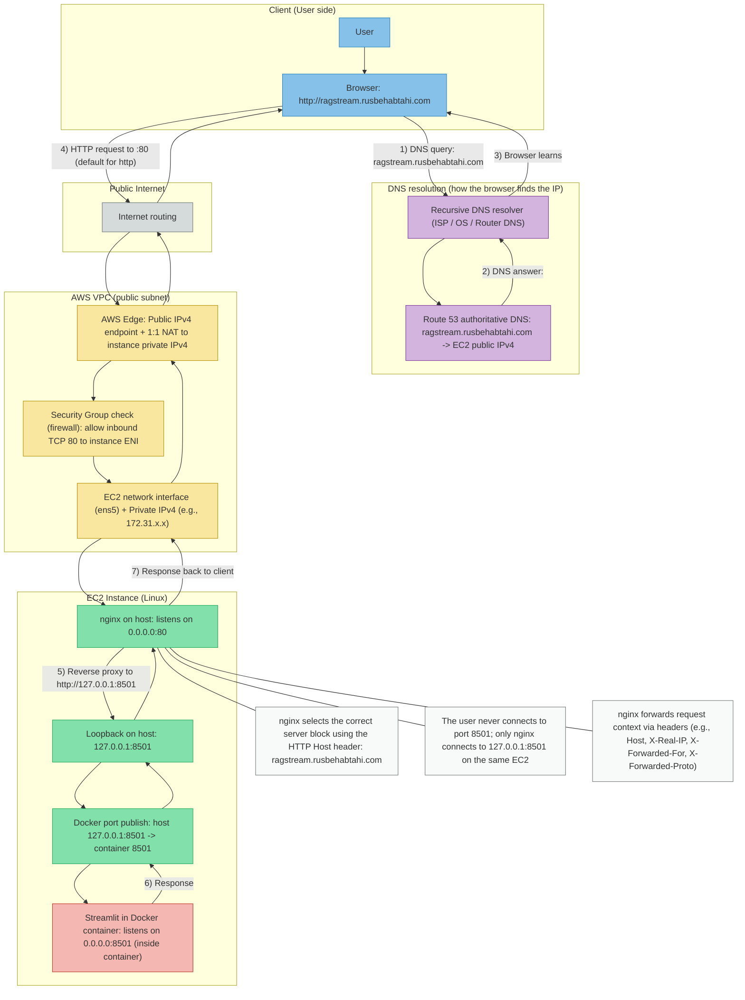

# RAGstream HTTP Reverse Proxy Architecture (Route 53 → EC2 → nginx → Streamlit on localhost)



## What happens when a user opens ragstream.rusbehabtahi.com (HTTP)

1. DNS resolution (Route 53)

* The browser asks a recursive DNS resolver: “What IP belongs to ragstream.rusbehabtahi.com?”
* That resolver asks Route 53 (authoritative DNS for your domain).
* Route 53 returns the current EC2 public IPv4 address (<ec2-public-ip>) (because your EC2 startup script updates the A record).
* DNS returns only an IP address. DNS does not include ports.

2. Why the browser uses port 80

* The user entered an HTTP URL (http://...).
* For HTTP, the browser automatically uses port 80.
* This is equivalent to requesting [http://ragstream.rusbehabtahi.com:80](http://ragstream.rusbehabtahi.com:80).

3. AWS networking and the Security Group (important correction)

* The request targets the EC2 *public* IPv4, but the EC2 instance does not “own” that public IP on its Linux interface.
* AWS performs a 1:1 NAT at the AWS edge: the instance actually receives the traffic on its *private* IP (172.31.x.x) via its network interface (often named ens5).
* The Security Group is a firewall check applied to that network interface. It is not a “routing hop”; it simply allows/blocks inbound traffic (e.g., TCP 80).

4. nginx receives the request on port 80

* nginx runs on the EC2 host and listens on 0.0.0.0:80 (port 80 on all host interfaces).
* The HTTP request contains a Host header (ragstream.rusbehabtahi.com).
* nginx matches that Host header to server_name ragstream.rusbehabtahi.com in its config and chooses the correct server block.

5. Reverse proxy to localhost:8501 (host-local only)

* nginx forwards the request internally to [http://127.0.0.1:8501](http://127.0.0.1:8501) using proxy_pass.
* 127.0.0.1 is the loopback interface: it is reachable only inside the same EC2 machine.
* This means the Streamlit backend is not directly exposed to the internet; only nginx can reach it.

5.1) Why Docker is in the middle (because Streamlit runs in a container)

* Streamlit listens on port 8501 *inside the container*.
* Docker publishes that container port to the EC2 host at 127.0.0.1:8501.
* nginx talks to the host-local port (127.0.0.1:8501), and Docker forwards it to the container.

6. Response path back to the user

* Streamlit returns the response to nginx (through Docker’s port mapping).
* nginx returns that response to the browser.
* To the user it feels like they are talking directly to ragstream.rusbehabtahi.com, but technically they talk to nginx, and nginx talks to Streamlit on their behalf.

## Why the headers matter (high level)

* Because Streamlit is behind nginx, the direct TCP connection to Streamlit comes from nginx (not from the user).
* nginx forwards original request context via headers so the backend can still know:

  * the original domain (Host)
  * the real client IP (X-Real-IP / X-Forwarded-For)
  * the original protocol (X-Forwarded-Proto)

## Two quick sanity signatures (useful for debugging)

* If DNS is stale (TTL caching) or the A record points to an old IP: the domain may fail or hit the wrong machine for a few minutes.
* If nginx is reachable but the backend is down / not mapped: nginx typically returns 502 Bad Gateway.
* If the Security Group blocks port 80: nginx will never see the request at all.

```
::contentReference[oaicite:0]{index=0}
